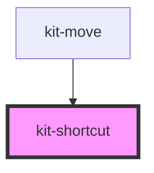

# kit-shortcut

<!-- Auto Generated Below -->

## Properties

| Property | Attribute | Description | Type                                                                                                                                                                                                                                                                        | Default     |
| -------- | --------- | ----------- | --------------------------------------------------------------------------------------------------------------------------------------------------------------------------------------------------------------------------------------------------------------------------- | ----------- |
| `data`   | `data`    |             | `BaseOptions & { type: "image"; image: HTMLImageElement; } \| BaseOptions & { type: "text"; text: string; fontSize: number; fontFamily: string; color: string; fontWeight: string; fontStyle: "normal" \| "italic"; decoration: "none" \| "underline" \| "line-through"; }` | `undefined` |
| `moveY`  | `move-y`  |             | `number`                                                                                                                                                                                                                                                                    | `0`         |

## Events

| Event      | Description | Type                                                                                                                                                                                                                                                                                     |
| ---------- | ----------- | ---------------------------------------------------------------------------------------------------------------------------------------------------------------------------------------------------------------------------------------------------------------------------------------- |
| `toDelete` |             | `CustomEvent<BaseOptions & { type: "image"; image: HTMLImageElement; } \| BaseOptions & { type: "text"; text: string; fontSize: number; fontFamily: string; color: string; fontWeight: string; fontStyle: "normal" \| "italic"; decoration: "none" \| "underline" \| "line-through"; }>` |
| `toDown`   |             | `CustomEvent<BaseOptions & { type: "image"; image: HTMLImageElement; } \| BaseOptions & { type: "text"; text: string; fontSize: number; fontFamily: string; color: string; fontWeight: string; fontStyle: "normal" \| "italic"; decoration: "none" \| "underline" \| "line-through"; }>` |
| `toUp`     |             | `CustomEvent<BaseOptions & { type: "image"; image: HTMLImageElement; } \| BaseOptions & { type: "text"; text: string; fontSize: number; fontFamily: string; color: string; fontWeight: string; fontStyle: "normal" \| "italic"; decoration: "none" \| "underline" \| "line-through"; }>` |

## Dependencies

### Used by

 - [kit-move](../kit-move)

### Graph

----------------------------------------------

*Built with [StencilJS](https://stenciljs.com/)*
