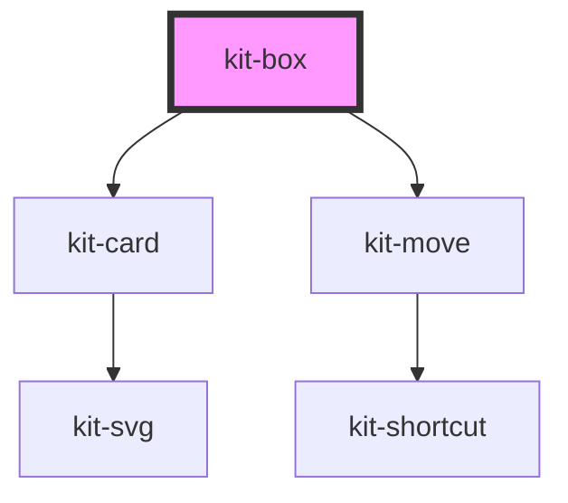

# kit-box

<!-- Auto Generated Below -->

## Properties

| Property | Attribute | Description | Type     | Default     |
| -------- | --------- | ----------- | -------- | ----------- |
| `height` | `height`  |             | `number` | `undefined` |
| `width`  | `width`   |             | `number` | `undefined` |

## Events

| Event               | Description | Type                                                                                                                                                                                                                                                                                     |
| ------------------- | ----------- | ---------------------------------------------------------------------------------------------------------------------------------------------------------------------------------------------------------------------------------------------------------------------------------------- |
| `currentDataChange` |             | `CustomEvent<BaseOptions & { type: "image"; image: HTMLImageElement; } \| BaseOptions & { type: "text"; text: string; fontSize: number; fontFamily: string; color: string; fontWeight: string; fontStyle: "normal" \| "italic"; decoration: "none" \| "underline" \| "line-through"; }>` |

## Methods

### `add(data: CardData) => Promise<void>`

#### Parameters

| Name   | Type                                                                                                                                                                                                                                                                            | Description |
| ------ | ------------------------------------------------------------------------------------------------------------------------------------------------------------------------------------------------------------------------------------------------------------------------------- | ----------- |
| `data` | `(BaseOptions & { type: "image"; image: HTMLImageElement; }) \| (BaseOptions & { type: "text"; text: string; fontSize: number; fontFamily: string; color: string; fontWeight: string; fontStyle: "normal" \| "italic"; decoration: "none" \| "underline" \| "line-through"; })` |             |

#### Returns

Type: `Promise<void>`

### `createPoster() => Promise<HTMLCanvasElement>`

#### Returns

Type: `Promise<HTMLCanvasElement>`

### `getDomList() => Promise<CardData[]>`

#### Returns

Type: `Promise<CardData[]>`

### `init(list?: CardData[]) => Promise<void>`

#### Parameters

| Name   | Type         | Description |
| ------ | ------------ | ----------- |
| `list` | `CardData[]` |             |

#### Returns

Type: `Promise<void>`

### `updateCurrentData(data: CardData) => Promise<void>`

#### Parameters

| Name   | Type                                                                                                                                                                                                                                                                            | Description |
| ------ | ------------------------------------------------------------------------------------------------------------------------------------------------------------------------------------------------------------------------------------------------------------------------------- | ----------- |
| `data` | `(BaseOptions & { type: "image"; image: HTMLImageElement; }) \| (BaseOptions & { type: "text"; text: string; fontSize: number; fontFamily: string; color: string; fontWeight: string; fontStyle: "normal" \| "italic"; decoration: "none" \| "underline" \| "line-through"; })` |             |

#### Returns

Type: `Promise<void>`

## Dependencies

### Depends on

- [kit-card](../kit-card)
- [kit-move](../kit-move)

### Graph

----------------------------------------------

*Built with [StencilJS](https://stenciljs.com/)*
