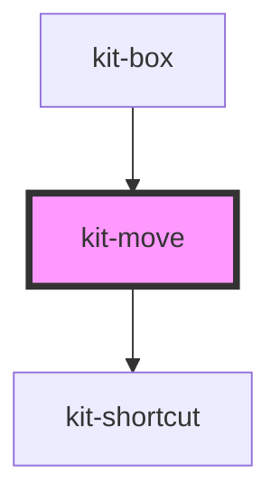

# kit-move

<!-- Auto Generated Below -->

## Properties

| Property | Attribute | Description | Type                                                                                                                                                                                                                                                                        | Default     |
| -------- | --------- | ----------- | --------------------------------------------------------------------------------------------------------------------------------------------------------------------------------------------------------------------------------------------------------------------------- | ----------- |
| `data`   | `data`    |             | `BaseOptions & { type: "image"; image: HTMLImageElement; } \| BaseOptions & { type: "text"; text: string; fontSize: number; fontFamily: string; color: string; fontWeight: string; fontStyle: "normal" \| "italic"; decoration: "none" \| "underline" \| "line-through"; }` | `undefined` |
| `zoom`   | `zoom`    |             | `number`                                                                                                                                                                                                                                                                    | `1`         |

## Events

| Event         | Description | Type                                                                                                                                                                                                                                                                                     |
| ------------- | ----------- | ---------------------------------------------------------------------------------------------------------------------------------------------------------------------------------------------------------------------------------------------------------------------------------------- |
| `dataChanged` |             | `CustomEvent<BaseOptions & { type: "image"; image: HTMLImageElement; } \| BaseOptions & { type: "text"; text: string; fontSize: number; fontFamily: string; color: string; fontWeight: string; fontStyle: "normal" \| "italic"; decoration: "none" \| "underline" \| "line-through"; }>` |
| `toDelete`    |             | `CustomEvent<BaseOptions & { type: "image"; image: HTMLImageElement; } \| BaseOptions & { type: "text"; text: string; fontSize: number; fontFamily: string; color: string; fontWeight: string; fontStyle: "normal" \| "italic"; decoration: "none" \| "underline" \| "line-through"; }>` |
| `toDown`      |             | `CustomEvent<BaseOptions & { type: "image"; image: HTMLImageElement; } \| BaseOptions & { type: "text"; text: string; fontSize: number; fontFamily: string; color: string; fontWeight: string; fontStyle: "normal" \| "italic"; decoration: "none" \| "underline" \| "line-through"; }>` |
| `toUp`        |             | `CustomEvent<BaseOptions & { type: "image"; image: HTMLImageElement; } \| BaseOptions & { type: "text"; text: string; fontSize: number; fontFamily: string; color: string; fontWeight: string; fontStyle: "normal" \| "italic"; decoration: "none" \| "underline" \| "line-through"; }>` |

## Dependencies

### Used by

- [kit-box](../kit-box)

### Depends on

- [kit-shortcut](../kit-shortcut)

### Graph

---

_Built with [StencilJS](https://stenciljs.com/)_
